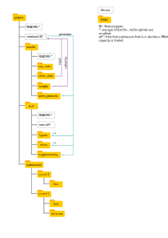

# Computational notebooks to increase productivity and reproducibility

This repository contains the (for now) very basic tools to start working with computational notebooks as accompanying pieces for your manuscript.

It includes a basic folder structure:

and a R and a Pluto (Julia language) notebook that structure the workflow as such:

# Acknowledgements
[[https://github.com/ludmillafigueiredo/rr-init][Reproducible Research Project Initialization]]

